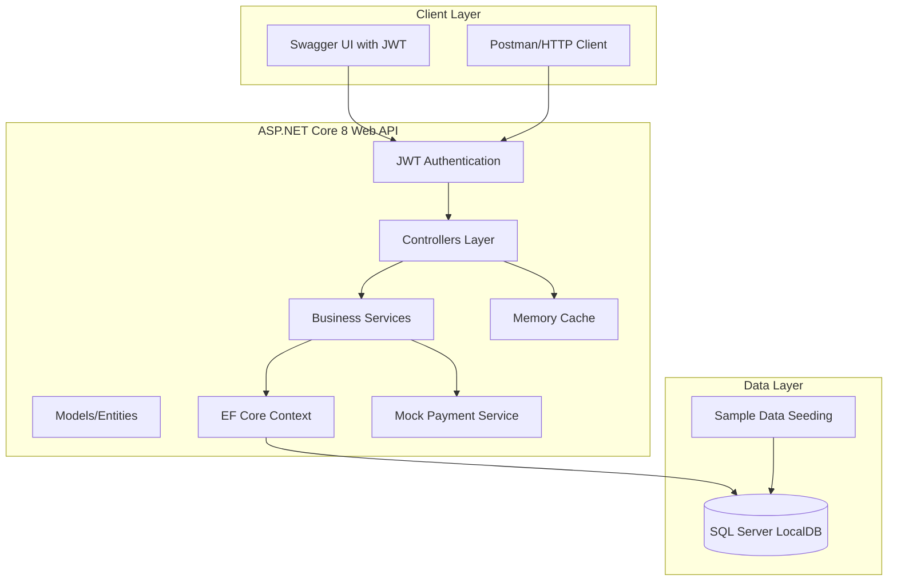
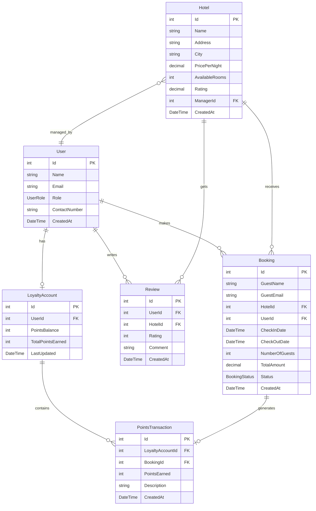

# Design Document

## Overview

The FinalDestination System is designed as a beginner-friendly ASP.NET Core 8 Web API that demonstrates core concepts without enterprise complexity. The system uses an In-Memory database for zero-setup learning, focuses on essential CRUD operations, and provides comprehensive Swagger documentation. The architecture prioritizes readability and learning over scalability, making it perfect for developers new to .NET.

## Architecture

### Learning-Focused Architecture



### Technology Stack (Learning-Focused)

**Backend:**
- Framework: ASP.NET Core 8 Web API
- Database: Entity Framework Core 9 with SQL Server LocalDB
- Authentication: JWT Bearer tokens (simple implementation)
- Caching: IMemoryCache (built-in, no Redis complexity)
- Documentation: Swagger/Swashbuckle (default page)
- Validation: Data Annotations (built-in)
- JSON: System.Text.Json (built-in)
- Password Hashing: BCrypt.Net-Next

**Local Services:**
- Mock Payment Service (simulates payment processing)
- Simple JWT authentication (no external identity providers)
- SQL Server LocalDB (no complex database setup)
- In-memory caching (no external cache dependencies)
- Local file logging (no external logging services)

## Components and Interfaces

### 1. Data Models (Simple Entities)

**Core Models with Basic Properties:**

```csharp
// User.cs - User management with authentication
public class User
{
    public int Id { get; set; }
    public string Name { get; set; } = string.Empty;
    public string Email { get; set; } = string.Empty;
    public string PasswordHash { get; set; } = string.Empty;
    public UserRole Role { get; set; }
    public string? ContactNumber { get; set; }
    public DateTime CreatedAt { get; set; } = DateTime.UtcNow;
    public DateTime? LastLoginAt { get; set; }
    public bool IsActive { get; set; } = true;
    
    // Navigation Properties
    public ICollection<Booking> Bookings { get; set; } = new List<Booking>();
    public ICollection<Review> Reviews { get; set; } = new List<Review>();
    public LoyaltyAccount? LoyaltyAccount { get; set; }
}

public enum UserRole
{
    Guest = 1,
    HotelManager = 2,
    Admin = 3
}

// Hotel.cs - Core hotel information
public class Hotel
{
    public int Id { get; set; }
    public string Name { get; set; } = string.Empty;
    public string Address { get; set; } = string.Empty;
    public string City { get; set; } = string.Empty;
    public decimal PricePerNight { get; set; }
    public int AvailableRooms { get; set; }
    public decimal Rating { get; set; }
    public int? ManagerId { get; set; }
    public DateTime CreatedAt { get; set; } = DateTime.UtcNow;
    
    // Navigation Properties
    public User? Manager { get; set; }
    public ICollection<Booking> Bookings { get; set; } = new List<Booking>();
    public ICollection<Review> Reviews { get; set; } = new List<Review>();
}

// Booking.cs - Simple booking management
public class Booking
{
    public int Id { get; set; }
    public string GuestName { get; set; } = string.Empty;
    public string GuestEmail { get; set; } = string.Empty;
    public int HotelId { get; set; }
    public int? UserId { get; set; }
    public DateTime CheckInDate { get; set; }
    public DateTime CheckOutDate { get; set; }
    public int NumberOfGuests { get; set; }
    public decimal TotalAmount { get; set; }
    public BookingStatus Status { get; set; } = BookingStatus.Confirmed;
    public DateTime CreatedAt { get; set; } = DateTime.UtcNow;
    
    // Navigation Properties
    public Hotel Hotel { get; set; } = null!;
    public User? User { get; set; }
}

public enum BookingStatus
{
    Confirmed = 1,
    Cancelled = 2,
    Completed = 3
}

// Review.cs - Simple review system
public class Review
{
    public int Id { get; set; }
    public int UserId { get; set; }
    public int HotelId { get; set; }
    public int Rating { get; set; } // 1-5
    public string Comment { get; set; } = string.Empty;
    public DateTime CreatedAt { get; set; } = DateTime.UtcNow;
    
    // Navigation Properties
    public User User { get; set; } = null!;
    public Hotel Hotel { get; set; } = null!;
}

// LoyaltyAccount.cs - Basic loyalty points
public class LoyaltyAccount
{
    public int Id { get; set; }
    public int UserId { get; set; }
    public int PointsBalance { get; set; }
    public int TotalPointsEarned { get; set; }
    public DateTime LastUpdated { get; set; } = DateTime.UtcNow;
    
    // Navigation Properties
    public User User { get; set; } = null!;
    public ICollection<PointsTransaction> Transactions { get; set; } = new List<PointsTransaction>();
}

// PointsTransaction.cs - Points history
public class PointsTransaction
{
    public int Id { get; set; }
    public int LoyaltyAccountId { get; set; }
    public int? BookingId { get; set; }
    public int PointsEarned { get; set; }
    public string Description { get; set; } = string.Empty;
    public DateTime CreatedAt { get; set; } = DateTime.UtcNow;
    
    // Navigation Properties
    public LoyaltyAccount LoyaltyAccount { get; set; } = null!;
    public Booking? Booking { get; set; }
}
```

### 2. Database Context (EF Core with SQL Server)

```csharp
public class HotelContext : DbContext
{
    public HotelContext(DbContextOptions<HotelContext> options) : base(options) { }
    
    public DbSet<User> Users { get; set; }
    public DbSet<Hotel> Hotels { get; set; }
    public DbSet<Booking> Bookings { get; set; }
    public DbSet<Review> Reviews { get; set; }
    public DbSet<LoyaltyAccount> LoyaltyAccounts { get; set; }
    public DbSet<PointsTransaction> PointsTransactions { get; set; }
    public DbSet<Payment> Payments { get; set; }
    
    protected override void OnModelCreating(ModelBuilder modelBuilder)
    {
        // User Configuration
        modelBuilder.Entity<User>(entity =>
        {
            entity.HasIndex(e => e.Email).IsUnique();
            entity.Property(e => e.Email).HasMaxLength(255);
            entity.Property(e => e.Name).HasMaxLength(100);
        });
        
        // Hotel Configuration
        modelBuilder.Entity<Hotel>(entity =>
        {
            entity.Property(e => e.PricePerNight).HasPrecision(10, 2);
            entity.Property(e => e.Rating).HasPrecision(3, 2);
            entity.Property(e => e.Name).HasMaxLength(200);
            entity.Property(e => e.Address).HasMaxLength(500);
            entity.Property(e => e.City).HasMaxLength(100);
        });
        
        // Booking Configuration
        modelBuilder.Entity<Booking>(entity =>
        {
            entity.Property(e => e.TotalAmount).HasPrecision(10, 2);
            entity.Property(e => e.GuestName).HasMaxLength(100);
            entity.Property(e => e.GuestEmail).HasMaxLength(255);
            entity.HasOne(b => b.Hotel)
                  .WithMany(h => h.Bookings)
                  .HasForeignKey(b => b.HotelId);
        });
        
        // Payment Configuration
        modelBuilder.Entity<Payment>(entity =>
        {
            entity.Property(e => e.Amount).HasPrecision(10, 2);
            entity.Property(e => e.Currency).HasMaxLength(3).HasDefaultValue("USD");
            entity.HasOne(p => p.Booking)
                  .WithMany()
                  .HasForeignKey(p => p.BookingId);
        });
        
        // Review Configuration
        modelBuilder.Entity<Review>(entity =>
        {
            entity.HasOne(r => r.User)
                  .WithMany(u => u.Reviews)
                  .HasForeignKey(r => r.UserId);
            entity.HasOne(r => r.Hotel)
                  .WithMany(h => h.Reviews)
                  .HasForeignKey(r => r.HotelId);
            entity.Property(r => r.Comment).HasMaxLength(1000);
        });
        
        // Loyalty Configuration
        modelBuilder.Entity<LoyaltyAccount>(entity =>
        {
            entity.HasOne(l => l.User)
                  .WithOne(u => u.LoyaltyAccount)
                  .HasForeignKey<LoyaltyAccount>(l => l.UserId);
        });
    }
}
```

### 3. Authentication Service (Simple JWT Implementation)

```csharp
// IJwtService.cs - JWT token management
public interface IJwtService
{
    string GenerateToken(User user);
    ClaimsPrincipal? ValidateToken(string token);
    int? GetUserIdFromToken(string token);
}

// JwtService.cs - Simple JWT implementation
public class JwtService : IJwtService
{
    private readonly IConfiguration _configuration;
    
    public JwtService(IConfiguration configuration)
    {
        _configuration = configuration;
    }
    
    public string GenerateToken(User user)
    {
        var key = new SymmetricSecurityKey(Encoding.UTF8.GetBytes(_configuration["Jwt:Key"]!));
        var credentials = new SigningCredentials(key, SecurityAlgorithms.HmacSha256);
        
        var claims = new[]
        {
            new Claim(ClaimTypes.NameIdentifier, user.Id.ToString()),
            new Claim(ClaimTypes.Email, user.Email),
            new Claim(ClaimTypes.Name, user.Name),
            new Claim(ClaimTypes.Role, user.Role.ToString())
        };
        
        var token = new JwtSecurityToken(
            issuer: _configuration["Jwt:Issuer"],
            audience: _configuration["Jwt:Audience"],
            claims: claims,
            expires: DateTime.UtcNow.AddHours(24),
            signingCredentials: credentials
        );
        
        return new JwtSecurityTokenHandler().WriteToken(token);
    }
    
    public ClaimsPrincipal? ValidateToken(string token)
    {
        // Simple validation implementation
        // Returns ClaimsPrincipal if valid, null if invalid
    }
}

// AuthController.cs - Authentication endpoints
[ApiController]
[Route("api/[controller]")]
public class AuthController : ControllerBase
{
    private readonly HotelContext _context;
    private readonly IJwtService _jwtService;
    
    [HttpPost("register")]
    public async Task<ActionResult<AuthResponse>> Register(RegisterRequest request)
    
    [HttpPost("login")]
    public async Task<ActionResult<AuthResponse>> Login(LoginRequest request)
    
    [HttpPost("refresh")]
    [Authorize]
    public async Task<ActionResult<AuthResponse>> RefreshToken()
}
```

### 4. Payment Service (Mock Implementation)

```csharp
// IPaymentService.cs - Payment processing interface
public interface IPaymentService
{
    Task<PaymentResult> ProcessPaymentAsync(PaymentRequest request);
    Task<PaymentResult> RefundPaymentAsync(int paymentId, decimal amount);
    Task<Payment?> GetPaymentAsync(int paymentId);
}

// MockPaymentService.cs - Local payment simulation
public class MockPaymentService : IPaymentService
{
    private readonly HotelContext _context;
    private readonly ILogger<MockPaymentService> _logger;
    
    public async Task<PaymentResult> ProcessPaymentAsync(PaymentRequest request)
    {
        // Simulate payment processing delay
        await Task.Delay(1000);
        
        // Simulate 90% success rate
        var isSuccess = Random.Shared.NextDouble() > 0.1;
        
        var payment = new Payment
        {
            BookingId = request.BookingId,
            Amount = request.Amount,
            Currency = request.Currency,
            PaymentMethod = request.PaymentMethod,
            Status = isSuccess ? PaymentStatus.Completed : PaymentStatus.Failed,
            TransactionId = Guid.NewGuid().ToString("N")[..12].ToUpper(),
            ProcessedAt = DateTime.UtcNow
        };
        
        _context.Payments.Add(payment);
        await _context.SaveChangesAsync();
        
        return new PaymentResult
        {
            PaymentId = payment.Id,
            Status = payment.Status,
            TransactionId = payment.TransactionId,
            Amount = payment.Amount,
            Currency = payment.Currency,
            ErrorMessage = isSuccess ? null : "Payment processing failed"
        };
    }
}

// Payment.cs - Payment entity
public class Payment
{
    public int Id { get; set; }
    public int BookingId { get; set; }
    public decimal Amount { get; set; }
    public string Currency { get; set; } = "USD";
    public PaymentMethod PaymentMethod { get; set; }
    public PaymentStatus Status { get; set; }
    public string TransactionId { get; set; } = string.Empty;
    public DateTime? ProcessedAt { get; set; }
    public DateTime CreatedAt { get; set; } = DateTime.UtcNow;
    
    // Navigation Properties
    public Booking Booking { get; set; } = null!;
}

public enum PaymentMethod
{
    CreditCard = 1,
    DebitCard = 2,
    PayPal = 3,
    BankTransfer = 4
}

public enum PaymentStatus
{
    Pending = 1,
    Completed = 2,
    Failed = 3,
    Refunded = 4
}
```

### 5. Caching Service (Simple Memory Cache)

```csharp
// ICacheService.cs - Simple caching interface
public interface ICacheService
{
    Task<T?> GetAsync<T>(string key) where T : class;
    Task SetAsync<T>(string key, T value, TimeSpan? expiration = null) where T : class;
    Task RemoveAsync(string key);
    Task RemoveByPatternAsync(string pattern);
}

// CacheService.cs - Memory cache implementation
public class CacheService : ICacheService
{
    private readonly IMemoryCache _cache;
    private readonly ILogger<CacheService> _logger;
    
    public CacheService(IMemoryCache cache, ILogger<CacheService> logger)
    {
        _cache = cache;
        _logger = logger;
    }
    
    public Task<T?> GetAsync<T>(string key) where T : class
    {
        var value = _cache.Get<T>(key);
        _logger.LogDebug("Cache {Action} for key: {Key}", value != null ? "HIT" : "MISS", key);
        return Task.FromResult(value);
    }
    
    public Task SetAsync<T>(string key, T value, TimeSpan? expiration = null) where T : class
    {
        var options = new MemoryCacheEntryOptions
        {
            AbsoluteExpirationRelativeToNow = expiration ?? TimeSpan.FromMinutes(30),
            SlidingExpiration = TimeSpan.FromMinutes(5)
        };
        
        _cache.Set(key, value, options);
        _logger.LogDebug("Cache SET for key: {Key}", key);
        return Task.CompletedTask;
    }
}
```

### 6. Controllers (REST Endpoints with Authentication)

**Controllers with JWT authentication and caching:**

```csharp
// HotelsController.cs - Hotel management with caching
[ApiController]
[Route("api/[controller]")]
public class HotelsController : ControllerBase
{
    private readonly HotelContext _context;
    private readonly ICacheService _cache;
    
    // GET api/hotels (cached for 10 minutes)
    public async Task<ActionResult<IEnumerable<Hotel>>> GetHotels()
    
    // GET api/hotels/5 (cached)
    public async Task<ActionResult<Hotel>> GetHotel(int id)
    
    // GET api/hotels/search?city=Miami&maxPrice=200 (cached)
    public async Task<ActionResult<IEnumerable<Hotel>>> SearchHotels(string? city, decimal? maxPrice)
    
    // POST api/hotels (requires HotelManager or Admin role)
    [Authorize(Roles = "HotelManager,Admin")]
    public async Task<ActionResult<Hotel>> CreateHotel(CreateHotelRequest request)
    
    // PUT api/hotels/5 (requires HotelManager or Admin role)
    [Authorize(Roles = "HotelManager,Admin")]
    public async Task<IActionResult> UpdateHotel(int id, UpdateHotelRequest request)
    
    // DELETE api/hotels/5 (requires Admin role)
    [Authorize(Roles = "Admin")]
    public async Task<IActionResult> DeleteHotel(int id)
}

// BookingsController.cs - Booking management with payment
[ApiController]
[Route("api/[controller]")]
public class BookingsController : ControllerBase
{
    private readonly HotelContext _context;
    private readonly IPaymentService _paymentService;
    
    // GET api/bookings (requires authentication)
    [Authorize]
    public async Task<ActionResult<IEnumerable<Booking>>> GetBookings()
    
    // GET api/bookings/5 (requires authentication)
    [Authorize]
    public async Task<ActionResult<Booking>> GetBooking(int id)
    
    // GET api/bookings/my (get current user's bookings)
    [Authorize]
    public async Task<ActionResult<IEnumerable<Booking>>> GetMyBookings()
    
    // POST api/bookings (requires authentication)
    [Authorize]
    public async Task<ActionResult<BookingResponse>> CreateBooking(CreateBookingRequest request)
    
    // POST api/bookings/5/payment (process payment)
    [Authorize]
    public async Task<ActionResult<PaymentResult>> ProcessPayment(int id, PaymentRequest request)
    
    // PUT api/bookings/5/cancel (requires authentication)
    [Authorize]
    public async Task<IActionResult> CancelBooking(int id)
}

// PaymentsController.cs - Payment management
[ApiController]
[Route("api/[controller]")]
[Authorize]
public class PaymentsController : ControllerBase
{
    private readonly IPaymentService _paymentService;
    
    // GET api/payments/5
    public async Task<ActionResult<Payment>> GetPayment(int id)
    
    // POST api/payments/5/refund
    public async Task<ActionResult<PaymentResult>> RefundPayment(int id, RefundRequest request)
}
```

### 4. Data Transfer Objects (Simple DTOs)

```csharp
// BookingRequest.cs - Input validation
public class BookingRequest
{
    [Required]
    public string GuestName { get; set; } = string.Empty;
    
    [Required]
    [EmailAddress]
    public string GuestEmail { get; set; } = string.Empty;
    
    [Required]
    public int HotelId { get; set; }
    
    [Required]
    public DateTime CheckInDate { get; set; }
    
    [Required]
    public DateTime CheckOutDate { get; set; }
    
    [Range(1, 10)]
    public int NumberOfGuests { get; set; } = 1;
}

// HotelSearchRequest.cs - Search parameters
public class HotelSearchRequest
{
    public string? City { get; set; }
    public decimal? MaxPrice { get; set; }
    public decimal? MinRating { get; set; }
}

// ReviewRequest.cs - Review submission
public class ReviewRequest
{
    [Required]
    public int UserId { get; set; }
    
    [Required]
    public int HotelId { get; set; }
    
    [Range(1, 5)]
    public int Rating { get; set; }
    
    [MaxLength(1000)]
    public string Comment { get; set; } = string.Empty;
}
```

## Data Models

### Entity Relationships (Simplified)



## Error Handling

### Simple Error Response Format

```csharp
public class ErrorResponse
{
    public string Message { get; set; } = string.Empty;
    public string? Details { get; set; }
    public DateTime Timestamp { get; set; } = DateTime.UtcNow;
}
```

### Error Handling Strategy

1. **Model Validation**: Use Data Annotations for automatic validation
2. **Not Found**: Return 404 with descriptive messages
3. **Bad Request**: Return 400 for validation failures
4. **Business Logic**: Simple validation in controllers
5. **Global Exception**: Basic try-catch in controller actions

## Testing Strategy

### Learning-Focused Testing Approach

1. **Manual Testing**: Swagger UI for interactive testing
2. **Sample Data**: Pre-seeded data for immediate experimentation
3. **Postman Collection**: Exportable collection for testing workflows
4. **Unit Tests**: Optional simple tests for learning TDD concepts
5. **Integration Tests**: Basic tests showing EF Core testing patterns

### Sample Data Seeding

```csharp
public static class DataSeeder
{
    public static void SeedData(HotelContext context)
    {
        // Sample Users
        var users = new List<User>
        {
            new() { Name = "John Admin", Email = "admin@hotel.com", Role = UserRole.Admin },
            new() { Name = "Jane Manager", Email = "manager@hotel.com", Role = UserRole.HotelManager },
            new() { Name = "Bob Guest", Email = "guest@example.com", Role = UserRole.Guest }
        };
        
        // Sample Hotels
        var hotels = new List<Hotel>
        {
            new() { Name = "Grand Plaza Hotel", Address = "123 Main St", City = "New York", 
                   PricePerNight = 150.00m, AvailableRooms = 50, Rating = 4.5m, ManagerId = 2 },
            new() { Name = "Ocean View Resort", Address = "456 Beach Ave", City = "Miami", 
                   PricePerNight = 200.00m, AvailableRooms = 30, Rating = 4.8m, ManagerId = 2 },
            new() { Name = "Mountain Lodge", Address = "789 Peak Rd", City = "Denver", 
                   PricePerNight = 120.00m, AvailableRooms = 25, Rating = 4.2m, ManagerId = 2 }
        };
        
        // Sample Bookings and Reviews
        // ... additional sample data
    }
}
```

## API Documentation

### Application Configuration

```csharp
// Program.cs - Complete application setup
var builder = WebApplication.CreateBuilder(args);

// Add services to the container
builder.Services.AddControllers();

// Database Configuration
builder.Services.AddDbContext<HotelContext>(options =>
    options.UseSqlServer(builder.Configuration.GetConnectionString("DefaultConnection")));

// Authentication Configuration
builder.Services.AddAuthentication(JwtBearerDefaults.AuthenticationScheme)
    .AddJwtBearer(options =>
    {
        options.TokenValidationParameters = new TokenValidationParameters
        {
            ValidateIssuer = true,
            ValidateAudience = true,
            ValidateLifetime = true,
            ValidateIssuerSigningKey = true,
            ValidIssuer = builder.Configuration["Jwt:Issuer"],
            ValidAudience = builder.Configuration["Jwt:Audience"],
            IssuerSigningKey = new SymmetricSecurityKey(
                Encoding.UTF8.GetBytes(builder.Configuration["Jwt:Key"]!))
        };
    });

builder.Services.AddAuthorization();

// Service Registration
builder.Services.AddScoped<IJwtService, JwtService>();
builder.Services.AddScoped<IPaymentService, MockPaymentService>();
builder.Services.AddScoped<ICacheService, CacheService>();
builder.Services.AddMemoryCache();

// Swagger Configuration with JWT
builder.Services.AddSwaggerGen(c =>
{
    c.SwaggerDoc("v1", new OpenApiInfo
    {
        Title = "FinalDestination System API",
        Version = "v1",
        Description = "A learning-focused hotel booking API with JWT authentication"
    });
    
    // Add JWT authentication to Swagger
    c.AddSecurityDefinition("Bearer", new OpenApiSecurityScheme
    {
        Description = "JWT Authorization header using the Bearer scheme",
        Name = "Authorization",
        In = ParameterLocation.Header,
        Type = SecuritySchemeType.ApiKey,
        Scheme = "Bearer"
    });
    
    c.AddSecurityRequirement(new OpenApiSecurityRequirement
    {
        {
            new OpenApiSecurityScheme
            {
                Reference = new OpenApiReference
                {
                    Type = ReferenceType.SecurityScheme,
                    Id = "Bearer"
                }
            },
            Array.Empty<string>()
        }
    });
});

var app = builder.Build();

// Configure the HTTP request pipeline
if (app.Environment.IsDevelopment())
{
    app.UseSwagger();
    app.UseSwaggerUI(c =>
    {
        c.SwaggerEndpoint("/swagger/v1/swagger.json", "FinalDestination System API v1");
        c.RoutePrefix = string.Empty; // Makes Swagger UI the default page
    });
}

app.UseHttpsRedirection();
app.UseAuthentication();
app.UseAuthorization();
app.MapControllers();

// Database initialization and seeding
using (var scope = app.Services.CreateScope())
{
    var context = scope.ServiceProvider.GetRequiredService<HotelContext>();
    await context.Database.EnsureCreatedAsync();
    await DataSeeder.SeedAsync(context);
}

app.Run();
```

### Configuration Files

```json
// appsettings.json
{
  "ConnectionStrings": {
    "DefaultConnection": "Server=(localdb)\\mssqllocaldb;Database=FinalDestinationDB;Trusted_Connection=true;MultipleActiveResultSets=true"
  },
  "Jwt": {
    "Key": "YourSuperSecretKeyThatIsAtLeast32CharactersLong!",
    "Issuer": "FinalDestination",
    "Audience": "FinalDestinationUsers"
  },
  "Logging": {
    "LogLevel": {
      "Default": "Information",
      "Microsoft.AspNetCore": "Warning"
    }
  }
}

// appsettings.Development.json
{
  "Logging": {
    "LogLevel": {
      "Default": "Information",
      "Microsoft.AspNetCore": "Information",
      "Microsoft.EntityFrameworkCore.Database.Command": "Information"
    }
  }
}
```

### Example API Responses

```json
// POST /api/auth/login
{
  "token": "eyJhbGciOiJIUzI1NiIsInR5cCI6IkpXVCJ9...",
  "user": {
    "id": 1,
    "name": "John Doe",
    "email": "john@example.com",
    "role": "Guest"
  },
  "expiresAt": "2024-12-02T10:00:00Z"
}

// GET /api/hotels/1
{
  "id": 1,
  "name": "Grand Plaza Hotel",
  "address": "123 Main St",
  "city": "New York",
  "pricePerNight": 150.00,
  "availableRooms": 50,
  "rating": 4.5,
  "managerId": 2,
  "createdAt": "2024-01-01T00:00:00Z"
}

// POST /api/bookings
{
  "id": 1,
  "guestName": "John Doe",
  "guestEmail": "john@example.com",
  "hotelId": 1,
  "userId": 1,
  "checkInDate": "2024-12-01",
  "checkOutDate": "2024-12-03",
  "numberOfGuests": 2,
  "totalAmount": 300.00,
  "status": "Confirmed",
  "createdAt": "2024-11-01T10:00:00Z"
}

// POST /api/bookings/1/payment
{
  "paymentId": 1,
  "status": "Completed",
  "transactionId": "TXN123456789",
  "amount": 300.00,
  "currency": "USD",
  "errorMessage": null
}
```

This design prioritizes learning and simplicity while still demonstrating core ASP.NET Core concepts and meeting the essential requirements from the original project specification.

