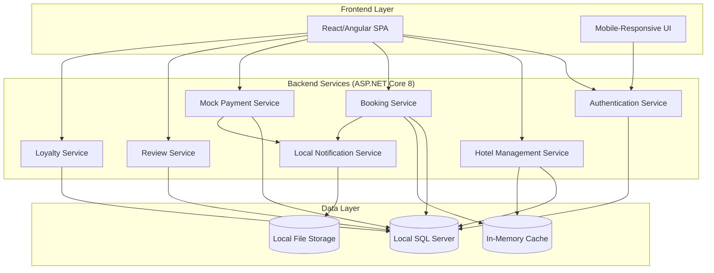

# Design Document

## Overview

The Smart Hotel Booking System is designed as a modern, scalable ASP.NET Core 8 web API using clean architecture principles with a React/Angular frontend, REST API backend, and SQL Server database. The system leverages Entity Framework Core 9, JWT Bearer authentication, and implements SOLID principles with clear separation of concerns across user management, hotel operations, booking processes, payment handling, and loyalty programs. The current implementation includes established models, controllers, and services following ASP.NET Core best practices.

## Architecture

### High-Level Architecture (Fully Local)



### Technology Stack

**Frontend:**
- Framework: React with TypeScript or Angular
- State Management: Redux Toolkit/NgRx
- UI Library: Material-UI/Angular Material
- HTTP Client: Axios/Angular HttpClient

**Backend (Local Implementation):**
- Framework: ASP.NET Core 8 Web API (fully local)
- Authentication: JWT Bearer tokens with local secret key management
- ORM: Entity Framework Core 9 with local SQL Server/SQLite provider
- Password Hashing: BCrypt.Net-Next (no external dependencies)
- API Documentation: Swagger/Swashbuckle.AspNetCore (local only)
- Dependency Injection: Built-in ASP.NET Core DI container
- Caching: IMemoryCache (in-memory, no Redis dependency)
- File Storage: Local file system for images and documents

**Database (Local):**
- Primary: Local SQL Server Express or SQLite for development
- Connection: Local connection strings only
- Migrations: EF Core Code-First migrations (local database)
- Indexing: Optimized for local development and testing
- Backup: Local database backup strategies

## Components and Interfaces

### 1. Authentication Service (Current Implementation)

**Responsibilities:**
- User registration and login via AuthController
- JWT token generation and validation using IJwtService
- Role-based access control with UserRole enum
- Password management with BCrypt hashing

**Current Interfaces:**
```csharp
public interface IJwtService
{
    string GenerateToken(User user);
    ClaimsPrincipal? ValidateToken(string token);
}

public interface IUserContext
{
    int? GetCurrentUserId();
    UserRole? GetCurrentUserRole();
    bool IsInRole(UserRole role);
}

public class User
{
    public int Id { get; set; }
    public string Name { get; set; } = string.Empty;
    public string Email { get; set; } = string.Empty;
    public string PasswordHash { get; set; } = string.Empty;
    public UserRole Role { get; set; }
    public string? ContactNumber { get; set; }
    // Navigation properties...
}

public enum UserRole
{
    Guest = 1,
    HotelManager = 2,
    Admin = 3
}
```

### 2. Hotel Management Service (Current Implementation)

**Responsibilities:**
- Hotel CRUD operations via HotelController
- Room inventory management with Room and RoomType entities
- Availability tracking through Availability entity
- Pricing management with decimal precision

**Current Models:**
```csharp
public class Hotel
{
    public int Id { get; set; }
    public string Name { get; set; } = string.Empty;
    public string Address { get; set; } = string.Empty;
    public string? City { get; set; }
    public string? Country { get; set; }
    public int? ManagerId { get; set; }
    public ICollection<Room>? Rooms { get; set; }
}

public class Room
{
    public int Id { get; set; }
    public int HotelId { get; set; }
    public string RoomNumber { get; set; } = string.Empty;
    public int RoomTypeId { get; set; }
    public decimal Price { get; set; }
    public string? Amenities { get; set; }
    public bool IsAvailable { get; set; } = true;
    public RoomType? RoomType { get; set; }
    public Hotel? Hotel { get; set; }
}

public class RoomType
{
    public int Id { get; set; }
    public string Name { get; set; } = string.Empty;
    public string? Description { get; set; }
    public decimal DefaultPrice { get; set; }
    public ICollection<Room>? Rooms { get; set; }
    public ICollection<RoomTypeAmenity>? RoomTypeAmenities { get; set; }
}

public class Availability
{
    public int Id { get; set; }
    public int RoomId { get; set; }
    public DateTime Date { get; set; }
    public bool IsAvailable { get; set; }
    // Navigation properties...
}
```

### 3. Booking Service

**Responsibilities:**
- Room reservation management
- Booking lifecycle handling
- Availability synchronization
- Cancellation processing

**Key Interfaces:**
```typescript
interface BookingService {
  createBooking(bookingData: BookingRequest): Promise<Booking>
  getBooking(bookingId: string): Promise<Booking>
  getUserBookings(userId: string): Promise<Booking[]>
  cancelBooking(bookingId: string, reason: string): Promise<CancellationResult>
  updateBookingStatus(bookingId: string, status: BookingStatus): Promise<Booking>
}

interface BookingRequest {
  userId: string
  roomId: string
  checkInDate: Date
  checkOutDate: Date
  guests: number
  specialRequests?: string
}

interface Booking {
  bookingId: string
  userId: string
  roomId: string
  hotelId: string
  checkInDate: Date
  checkOutDate: Date
  status: BookingStatus
  totalAmount: number
  paymentId?: string
}
```

### 4. Mock Payment Service (Local Implementation)

**Responsibilities:**
- Local payment simulation
- Transaction management (local database)
- Refund simulation
- Payment method validation (local rules)

**Local Interfaces:**
```csharp
public interface IPaymentService
{
    Task<PaymentResult> ProcessPaymentAsync(PaymentRequest request);
    Task<PaymentStatus> GetPaymentStatusAsync(int paymentId);
    Task<RefundResult> ProcessRefundAsync(int paymentId, decimal amount);
    Task<List<Payment>> GetPaymentHistoryAsync(int userId);
}

public class PaymentRequest
{
    public int BookingId { get; set; }
    public int UserId { get; set; }
    public decimal Amount { get; set; }
    public string Currency { get; set; } = "USD";
    public PaymentMethod PaymentMethod { get; set; }
    public MockCardDetails? CardDetails { get; set; }
}

public class PaymentResult
{
    public int PaymentId { get; set; }
    public PaymentStatus Status { get; set; }
    public string TransactionId { get; set; } = string.Empty;
    public decimal Amount { get; set; }
    public string Currency { get; set; } = "USD";
    public string? ErrorMessage { get; set; }
}

public enum PaymentMethod
{
    CreditCard,
    DebitCard,
    Cash,
    BankTransfer
}
```

### 5. Review Service

**Responsibilities:**
- Review submission and moderation
- Rating calculation
- Review response management
- Content filtering

**Key Interfaces:**
```typescript
interface ReviewService {
  submitReview(reviewData: ReviewSubmission): Promise<Review>
  getHotelReviews(hotelId: string, pagination: Pagination): Promise<ReviewPage>
  respondToReview(reviewId: string, response: string, managerId: string): Promise<ReviewResponse>
  moderateReview(reviewId: string, action: ModerationAction): Promise<void>
  calculateHotelRating(hotelId: string): Promise<number>
}

interface ReviewSubmission {
  userId: string
  hotelId: string
  bookingId: string
  rating: number
  comment: string
}

interface Review {
  reviewId: string
  userId: string
  hotelId: string
  rating: number
  comment: string
  timestamp: Date
  response?: ReviewResponse
  status: ReviewStatus
}
```

### 6. Loyalty Service

**Responsibilities:**
- Points calculation and management
- Redemption processing
- Loyalty tier management
- Reward tracking

**Key Interfaces:**
```typescript
interface LoyaltyService {
  awardPoints(userId: string, bookingId: string, amount: number): Promise<PointsTransaction>
  redeemPoints(userId: string, points: number, bookingId: string): Promise<RedemptionResult>
  getLoyaltyAccount(userId: string): Promise<LoyaltyAccount>
  getPointsHistory(userId: string): Promise<PointsTransaction[]>
  calculatePointsEarned(bookingAmount: number): number
}

interface LoyaltyAccount {
  loyaltyId: string
  userId: string
  pointsBalance: number
  tier: LoyaltyTier
  lastUpdated: Date
}

interface RedemptionResult {
  redemptionId: string
  pointsUsed: number
  discountAmount: number
  newBalance: number
}
```

## Data Models

### Core Entities

```sql
-- User Management
CREATE TABLE Users (
    UserID VARCHAR(36) PRIMARY KEY,
    Name VARCHAR(100) NOT NULL,
    Email VARCHAR(255) UNIQUE NOT NULL,
    PasswordHash VARCHAR(255) NOT NULL,
    Role ENUM('ADMIN', 'HOTEL_MANAGER', 'GUEST') NOT NULL,
    ContactNumber VARCHAR(20),
    CreatedAt TIMESTAMP DEFAULT CURRENT_TIMESTAMP,
    UpdatedAt TIMESTAMP DEFAULT CURRENT_TIMESTAMP ON UPDATE CURRENT_TIMESTAMP,
    IsActive BOOLEAN DEFAULT TRUE
);

-- Hotel Management
CREATE TABLE Hotels (
    HotelID VARCHAR(36) PRIMARY KEY,
    Name VARCHAR(200) NOT NULL,
    Description TEXT,
    Address VARCHAR(500) NOT NULL,
    City VARCHAR(100) NOT NULL,
    Country VARCHAR(100) NOT NULL,
    ManagerID VARCHAR(36) NOT NULL,
    Amenities JSON,
    Rating DECIMAL(3,2) DEFAULT 0.00,
    TotalReviews INT DEFAULT 0,
    CreatedAt TIMESTAMP DEFAULT CURRENT_TIMESTAMP,
    UpdatedAt TIMESTAMP DEFAULT CURRENT_TIMESTAMP ON UPDATE CURRENT_TIMESTAMP,
    IsActive BOOLEAN DEFAULT TRUE,
    FOREIGN KEY (ManagerID) REFERENCES Users(UserID)
);

CREATE TABLE Rooms (
    RoomID VARCHAR(36) PRIMARY KEY,
    HotelID VARCHAR(36) NOT NULL,
    RoomNumber VARCHAR(20) NOT NULL,
    Type ENUM('SINGLE', 'DOUBLE', 'SUITE', 'DELUXE') NOT NULL,
    Price DECIMAL(10,2) NOT NULL,
    Currency VARCHAR(3) DEFAULT 'USD',
    MaxOccupancy INT NOT NULL,
    Features JSON,
    IsAvailable BOOLEAN DEFAULT TRUE,
    CreatedAt TIMESTAMP DEFAULT CURRENT_TIMESTAMP,
    UpdatedAt TIMESTAMP DEFAULT CURRENT_TIMESTAMP ON UPDATE CURRENT_TIMESTAMP,
    FOREIGN KEY (HotelID) REFERENCES Hotels(HotelID),
    UNIQUE KEY unique_room (HotelID, RoomNumber)
);

-- Booking Management
CREATE TABLE Bookings (
    BookingID VARCHAR(36) PRIMARY KEY,
    UserID VARCHAR(36) NOT NULL,
    RoomID VARCHAR(36) NOT NULL,
    CheckInDate DATE NOT NULL,
    CheckOutDate DATE NOT NULL,
    Guests INT NOT NULL,
    Status ENUM('PENDING', 'CONFIRMED', 'CANCELLED', 'COMPLETED') DEFAULT 'PENDING',
    TotalAmount DECIMAL(10,2) NOT NULL,
    Currency VARCHAR(3) DEFAULT 'USD',
    SpecialRequests TEXT,
    CreatedAt TIMESTAMP DEFAULT CURRENT_TIMESTAMP,
    UpdatedAt TIMESTAMP DEFAULT CURRENT_TIMESTAMP ON UPDATE CURRENT_TIMESTAMP,
    FOREIGN KEY (UserID) REFERENCES Users(UserID),
    FOREIGN KEY (RoomID) REFERENCES Rooms(RoomID)
);

-- Payment Management
CREATE TABLE Payments (
    PaymentID VARCHAR(36) PRIMARY KEY,
    BookingID VARCHAR(36) NOT NULL,
    UserID VARCHAR(36) NOT NULL,
    Amount DECIMAL(10,2) NOT NULL,
    Currency VARCHAR(3) DEFAULT 'USD',
    PaymentMethod ENUM('CREDIT_CARD', 'DEBIT_CARD', 'PAYPAL', 'BANK_TRANSFER') NOT NULL,
    Status ENUM('PENDING', 'COMPLETED', 'FAILED', 'REFUNDED') DEFAULT 'PENDING',
    TransactionID VARCHAR(100),
    ProcessedAt TIMESTAMP NULL,
    CreatedAt TIMESTAMP DEFAULT CURRENT_TIMESTAMP,
    FOREIGN KEY (BookingID) REFERENCES Bookings(BookingID),
    FOREIGN KEY (UserID) REFERENCES Users(UserID)
);

-- Review System
CREATE TABLE Reviews (
    ReviewID VARCHAR(36) PRIMARY KEY,
    UserID VARCHAR(36) NOT NULL,
    HotelID VARCHAR(36) NOT NULL,
    BookingID VARCHAR(36) NOT NULL,
    Rating INT CHECK (Rating >= 1 AND Rating <= 5),
    Comment TEXT,
    Status ENUM('PENDING', 'APPROVED', 'REJECTED') DEFAULT 'PENDING',
    CreatedAt TIMESTAMP DEFAULT CURRENT_TIMESTAMP,
    UpdatedAt TIMESTAMP DEFAULT CURRENT_TIMESTAMP ON UPDATE CURRENT_TIMESTAMP,
    FOREIGN KEY (UserID) REFERENCES Users(UserID),
    FOREIGN KEY (HotelID) REFERENCES Hotels(HotelID),
    FOREIGN KEY (BookingID) REFERENCES Bookings(BookingID),
    UNIQUE KEY unique_review (UserID, BookingID)
);

-- Loyalty Program
CREATE TABLE LoyaltyAccounts (
    LoyaltyID VARCHAR(36) PRIMARY KEY,
    UserID VARCHAR(36) UNIQUE NOT NULL,
    PointsBalance INT DEFAULT 0,
    Tier ENUM('BRONZE', 'SILVER', 'GOLD', 'PLATINUM') DEFAULT 'BRONZE',
    LastUpdated TIMESTAMP DEFAULT CURRENT_TIMESTAMP ON UPDATE CURRENT_TIMESTAMP,
    FOREIGN KEY (UserID) REFERENCES Users(UserID)
);

CREATE TABLE Redemptions (
    RedemptionID VARCHAR(36) PRIMARY KEY,
    UserID VARCHAR(36) NOT NULL,
    BookingID VARCHAR(36) NOT NULL,
    PointsUsed INT NOT NULL,
    DiscountAmount DECIMAL(10,2) NOT NULL,
    Currency VARCHAR(3) DEFAULT 'USD',
    CreatedAt TIMESTAMP DEFAULT CURRENT_TIMESTAMP,
    FOREIGN KEY (UserID) REFERENCES Users(UserID),
    FOREIGN KEY (BookingID) REFERENCES Bookings(BookingID)
);
```

## Error Handling

### Error Response Format
```typescript
interface ErrorResponse {
  error: {
    code: string
    message: string
    details?: any
    timestamp: string
    path: string
  }
}
```

### Error Categories

1. **Authentication Errors (401)**
   - Invalid credentials
   - Expired tokens
   - Insufficient permissions

2. **Validation Errors (400)**
   - Invalid input data
   - Missing required fields
   - Business rule violations

3. **Resource Errors (404)**
   - Hotel not found
   - Booking not found
   - User not found

4. **Conflict Errors (409)**
   - Room already booked
   - Duplicate email registration
   - Concurrent modification

5. **Payment Errors (402)**
   - Payment processing failed
   - Insufficient funds
   - Invalid payment method

6. **System Errors (500)**
   - Database connection issues
   - External service failures
   - Unexpected system errors

### Error Handling Strategy

- **Frontend**: Global error interceptor with user-friendly messages
- **Backend**: Centralized exception handling with detailed logging
- **Database**: Transaction rollback on errors
- **External Services**: Circuit breaker pattern for resilience

## Testing Strategy

### Unit Testing
- **Coverage Target**: 80% minimum
- **Framework**: JUnit/NUnit for backend, Jest for frontend
- **Focus Areas**: Business logic, validation, calculations

### Integration Testing
- **Database Integration**: Test with in-memory database
- **API Integration**: Test complete request/response cycles
- **External Services**: Mock external dependencies

### End-to-End Testing
- **Framework**: Cypress or Selenium
- **Scenarios**: Complete user journeys from search to booking
- **Cross-browser**: Chrome, Firefox, Safari, Edge

### Performance Testing
- **Load Testing**: JMeter or Artillery for API endpoints
- **Stress Testing**: Peak booking periods simulation
- **Database Performance**: Query optimization and indexing

### Security Testing
- **Authentication**: JWT token validation
- **Authorization**: Role-based access control
- **Input Validation**: SQL injection and XSS prevention
- **Payment Security**: PCI DSS compliance testing

### Test Data Management
- **Test Database**: Separate environment with realistic data
- **Data Seeding**: Automated test data generation
- **Cleanup**: Automated test data cleanup after test runs

